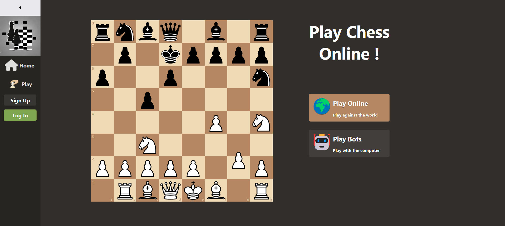
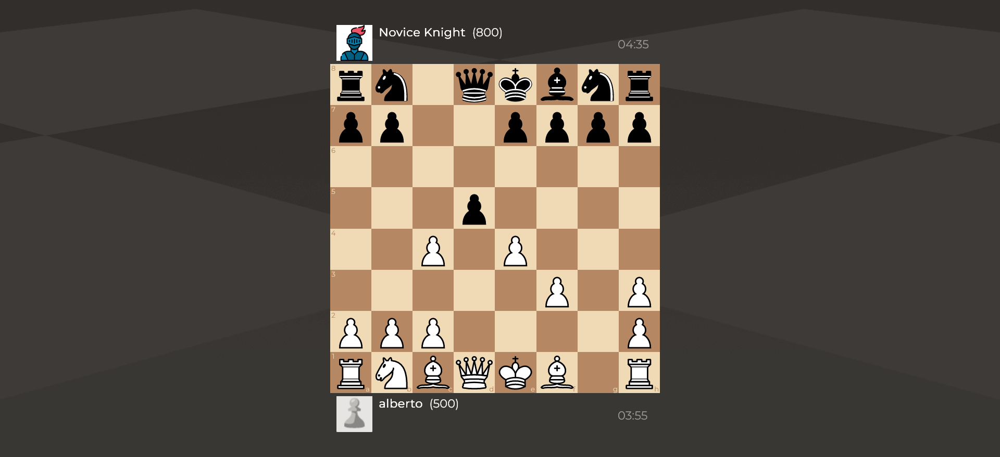

# Online chess project





## Table of Contents

- [Getting Started](#getting-started)
  - [Prerequisites](#prerequisites)
  - [Installation](#installation)
- [Usage](#usage)
- [Technologies](#technologies)
- [License](#license)

## Getting Started

These instructions will guide you on how to get a copy of the project up and running on your local machine for development and testing purposes.

### Prerequisites

- [Docker](https://www.docker.com/) installed on your machine.

### Installation

1. Clone the repository:

```shell
git clone https://github.com/An0n1mity/online-chess
```

2. Navigate to the project directory:

```shell
cd online-chess
```

3. Build the Docker containers:

```shell
docker-compose build
```

4. Start the Docker containers:

```shell
docker-compose up
```

5. Access the application in your web browser at [http://localhost:3000](http://localhost:3000).


## Technologies

- [Django](https://www.djangoproject.com/) - Web framework for backend development.
- [React](https://reactjs.org/) - JavaScript library for frontend development.
- [Celery](http://www.celeryproject.org/) - Distributed task queue for background processing.
- [Redis](https://redis.io/) - In-memory data structure store used as a message broker.
- [Docker](https://www.docker.com/) - Containerization platform for easy deployment and scalability.

## License

This project is licensed under the MIT License - see the [LICENSE.md](LICENSE.MD) file for details.

